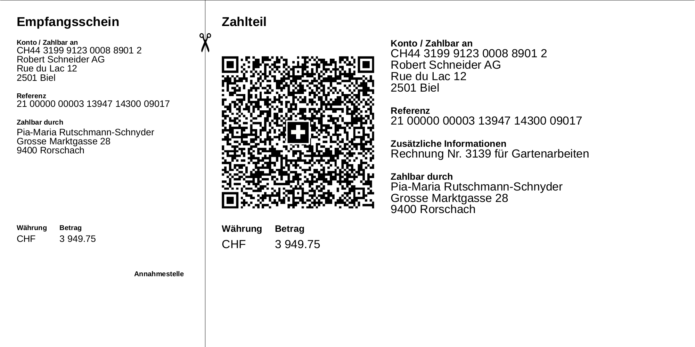

# swiss-qr-invoice



```golang
import invoice "github.com/72nd/swiss-qr-invoice"

invoice := Invoice{
	ReceiverIBAN:    "CH44 3199 9123 0008 8901 2",
	IsQrIBAN:        true,
	ReceiverName:    "Robert Schneider AG",
	ReceiverStreet:  "Rue du Lac",
	ReceiverNumber:  "12",
	ReceiverZIPCode: "2501",
	ReceiverPlace:   "Biel",
	ReceiverCountry: "CH",
	PayeeName:       "Pia-Maria Rutschmann-Schnyder",
	PayeeStreet:     "Grosse Marktgasse",
	PayeeNumber:     "28",
	PayeeZIPCode:    "9400",
	PayeePlace:      "Rorschach",
	PayeeCountry:    "CH",
	Reference:       "21 00000 00003 13947 14300 09017",
	AdditionalInfo:  "Rechnung Nr. 3139 für Gartenarbeiten",
	Amount:          "3 949.75",
	Currency:        "CHF",
}
invoice.SaveAsPDF("path/to/invoice.pdf")
```
