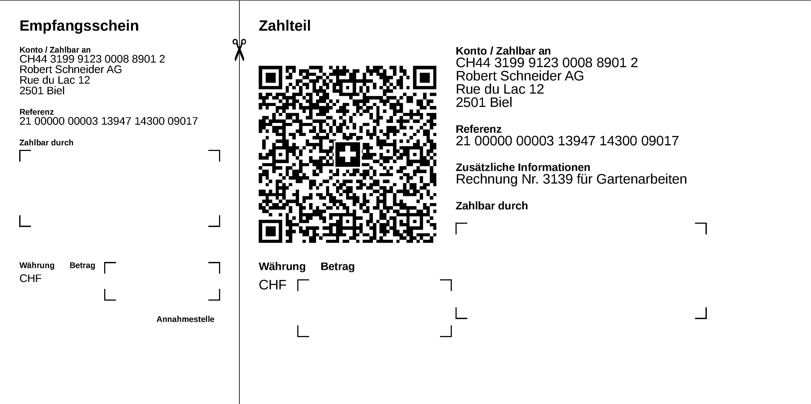

# swiss-qr-invoice

Generate Swiss QR Invoices as described in [this standard](https://www.paymentstandards.ch/dam/downloads/ig-qr-bill-de.pdf) and [the style guide](https://www.paymentstandards.ch/dam/downloads/style-guide-de.pdf). The library uses [gopdf](https://github.com/signintech/gopdf) via the [gopdf-wrapper](https://github.com/72nd/gopdf-wrapper) The invoice can be directly saved as PDF or further edited using via the `gopdf-wrapper`/`gopdf` element.

```golang
import inv "github.com/72nd/swiss-qr-invoice"

invoice := inv.Invoice{
	ReceiverIBAN:    "CH44 3199 9123 0008 8901 2",
	IsQrIBAN:        true,
	ReceiverName:    "Robert Schneider AG",
	ReceiverStreet:  "Rue du Lac",
	ReceiverNumber:  "12",
	ReceiverZIPCode: "2501",
	ReceiverPlace:   "Biel",
	ReceiverCountry: "CH",
	PayeeName:       "Pia-Maria Rutschmann-Schnyder",
	PayeeStreet:     "Grosse Marktgasse",
	PayeeNumber:     "28",
	PayeeZIPCode:    "9400",
	PayeePlace:      "Rorschach",
	PayeeCountry:    "CH",
	Reference:       "21 00000 00003 13947 14300 09017",
	AdditionalInfo:  "Rechnung Nr. 3139 für Gartenarbeiten",
	Amount:          "3 949.75",
	Currency:        "CHF",
}

// Directly save invoice as PDF.
invoice.SaveAsPDF("path/to/invoice.pdf")

// Use the gopdf-wrapper element to further customizing the invoice.
doc, err  := invoice.Doc()
if err != nil {
	log.Panic(err)
}
doc.AddSizedText(10, 10, "Your Invoice", 20)
doc.AddText(10, 20, "This is our invoice for our services")
if err := doc.WritePdf("path/to/invoice.pdf"); err != nil {
	log.Panic(err)
}
```



