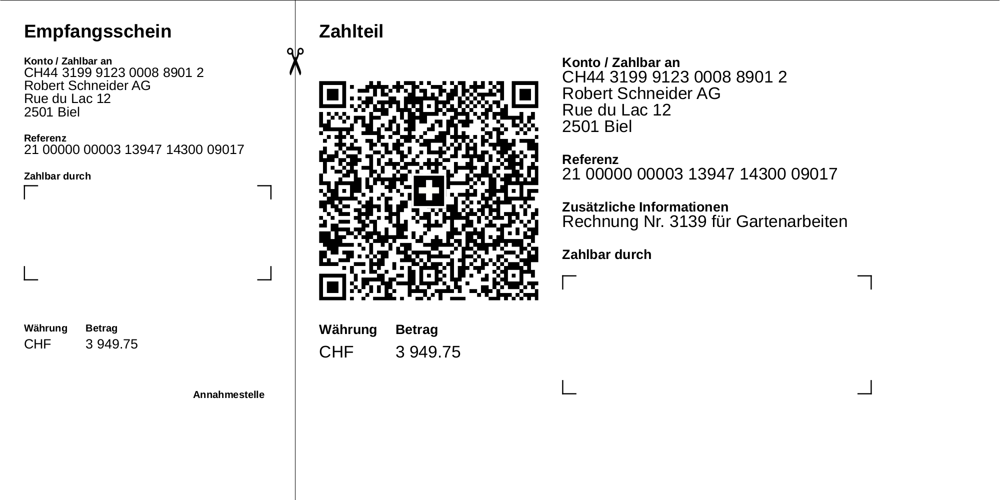

# swiss-qr-invoice

[](https://godoc.org/github.com/72nd/swiss-qr-invoice) [](https://goreportcard.com/report/github.com/72nd/swiss-qr-invoice)

Generate Swiss QR Invoices as described in [this standard](https://www.paymentstandards.ch/dam/downloads/ig-qr-bill-de.pdf) and [the style guide](https://www.paymentstandards.ch/dam/downloads/style-guide-de.pdf). The library uses [gopdf](https://github.com/signintech/gopdf) via the [gopdf-wrapper](https://github.com/72nd/gopdf-wrapper). 

 <p align="center">
  
</p>


## Use as a CLI app


Or use one of the pre-built binary application you can find on the [release page](https://github.com/72nd/acc/releases/latest). Download the binary for your system, make it executable and make sure that the binary is in the `PATH`. You can also compile and install the CLI application via go:

```shell script
go install github.com/72nd/swiss-qr-invoice/invoice-cli
```

To create an invoice first initialize a new invoice-YAML:

```shell script
invoice-cli new invoice.yaml
```

Then open the YAML file in your editor and adjust the values accordingly:

```yaml
# Your IBAN
receiver_iban: CH44 3199 9123 0008 8901 2
# Learn more about this field below.
is_qr_iban: true
# Your Name
receiver_name: Robert Schneider AG
# Your Street
receiver_street: Rue du Lac
# Your Street Number
receiver_number: "12"
# Your ZIP Code
receiver_zip_code: "2501"
# Your Place
receiver_place: Biel
# Your Contry as a two letter code
receiver_country: CH
# Your recepients name, omit this if you want a empty payee field
payee_name: Pia-Maria Rutschmann-Schnyder
# Your recepients street, omit this if you want a empty payee field
payee_street: Grosse Marktgasse
# Your recepients street number, omit this if you want a empty payee field
payee_number: "28"
# Your recepients ZIP code, omit this if you want a empty payee field
payee_zip_code: "9400"
# Your recepients place, omit this if you want a empty payee field
payee_place: Rorschach
# Your recepients country, omit this if you want a empty payee field
payee_country: CH
# Invoice referecne, omit this if you haven't got one
reference: 21 00000 00003 13947 14300 09017
# Additional payment information, omit this if you don't need this
additional_info: Rechnung Nr. 3139 für Gartenarbeiten
# The invoice amount, omit this if you want a empty amount field
amount: 3 949.75
// The currenct, can be CHF or EUR
currency: CHF
```

Some words about the `is_qr_iban` field: There is a special QR-Invocie IBAN associated with your account ([learn more](https://www.raiffeisen.ch/bern/de/firmenkunden/liquiditaet-und-zahlungsverkehr/harmonisierung-zahlungsverkehr/qr-rechnung/multiple-qr-iban.html)) if you don't use such a special IBAN set this field to `false`.

After you've configured the file, generate the invoice:

```shell script
invoice-cli generate -i invoice.yaml -o invoice.pdf
```


## Use as a library 

The invoice can be directly saved as PDF or further edited using via the `gopdf-wrapper`/`gopdf` element.

```golang
import inv "github.com/72nd/swiss-qr-invoice"

invoice := inv.Invoice{
	ReceiverIBAN:    "CH44 3199 9123 0008 8901 2",
	IsQrIBAN:        true,
	ReceiverName:    "Robert Schneider AG",
	ReceiverStreet:  "Rue du Lac",
	ReceiverNumber:  "12",
	ReceiverZIPCode: "2501",
	ReceiverPlace:   "Biel",
	ReceiverCountry: "CH",
	PayeeName:       "Pia-Maria Rutschmann-Schnyder",
	PayeeStreet:     "Grosse Marktgasse",
	PayeeNumber:     "28",
	PayeeZIPCode:    "9400",
	PayeePlace:      "Rorschach",
	PayeeCountry:    "CH",
	Reference:       "21 00000 00003 13947 14300 09017",
	AdditionalInfo:  "Rechnung Nr. 3139 für Gartenarbeiten",
	Amount:          "3 949.75",
	Currency:        "CHF",
}

// Directly save invoice as PDF.
invoice.SaveAsPDF("path/to/invoice.pdf")

// Use the gopdf-wrapper element to further customizing the invoice.
doc, err  := invoice.Doc()
if err != nil {
	log.Panic(err)
}
doc.AddSizedText(10, 10, "Your Invoice", 20)
doc.AddText(10, 20, "This is our invoice for our services")
if err := doc.WritePdf("path/to/invoice.pdf"); err != nil {
	log.Panic(err)
}
```

## Examples


It's also possible to omit the payee and/or the amount, the fields will be replaced with a rectangle field.


